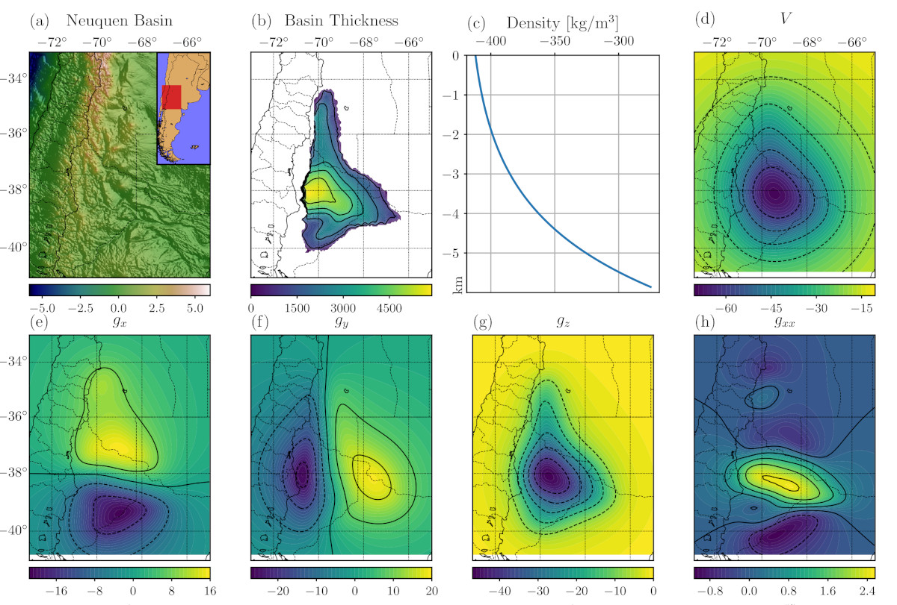

# Gravitational field calculation in spherical coordinates using variable densities in depth

by
Santiago R. Soler,
Agustina Pesce,
Mario E. Gimenez,
Leonardo Uieda

This paper has been submitted for publication in the *Geophysical Journal International*.

We introduce a novel methodology for gravity forward modeling in spherical coordinates
using tesseroids (spherical prisms) with variable densities in depth. It builds on
previous work by the authors and introduces a new density-based discretization algorithm
to ensure the accuracy of the numerical integration.


*Application of the methodology to the Neuquén Basin, a foreland basin in the southern
Andes. (a) Topography of the Neuquén Basin and its location in South America. (b)
Thickness of the sedimentary basin. Inset shows the exponential density profile used in
the modeling. (c) Resulting vertical gravitational acceleration at 10 km height modeled
by tesseroids with exponential density variation in depth. (d) Difference between
gravitational acceleration modeled using the exponential density profile and a
homogeneous density.*

## Abstract

We present a new methodology to compute the gravitational fields generated by
tesseroids (spherical prisms) whose density varies with depth according to
an arbitrary continuous function.
It approximates the gravitational fields through the Gauss-Legendre Quadrature along
with two discretization algorithms that automatically control its accuracy by adaptively
dividing the tesseroid into smaller ones.
The first one is a preexisting two dimensional adaptive discretization algorithm that
reduces the errors due to the distance between the tesseroid and the computation point.
The second is a new density-based discretization algorithm that
decreases the errors introduced by the variation of the density function with depth.
The amount of divisions made by each algorithm is indirectly controlled
by two parameters: the distance-size ratio and the delta ratio.
We have obtained analytical solutions for a spherical shell with radially variable
density and compared them to the results of the numerical model for linear,
exponential, and sinusoidal density functions.
The heavily oscillating density functions are intended only to test the algorithm to its
limits and not to emulate a real world case.
These comparisons allowed us to obtain optimal values for the distance-size and
delta ratios that yield an accuracy of 0.1% of the analytical solutions.
The resulting optimal values of distance-size ratio for the gravitational potential and
its gradient are 1 and 2.5, respectively.
The density-based discretization algorithm produces no discretizations in the linear
density case, but a delta ratio of 0.1 is needed for the exponential and most sinusoidal
density functions.
These values can be extrapolated to cover most common use cases, which are simpler than
oscillating density profiles.
However, the distance-size and delta ratios can be configured by the user to increase
the accuracy of the results at the expense of computational speed.
Lastly, we apply this new methodology to model the Neuquén Basin, a foreland basin in
Argentina with a maximum depth of over 5000m, using an exponential density function.


## Reproducing the results

You can download a copy of all the files in this repository by cloning the
[git](https://git-scm.com/) repository:

    git clone https://github.com/pinga-lab/tesseroid-variable-density.git

or [click here to download a zip archive](https://github.com/pinga-lab/tesseroid-variable-density/archive/master.zip).

All source code used to generate the results and figures in the paper are in
the `code` folder. There you can find the Python and Cython codes that
performs the gravity field calculations and scripts to generate all figures and results
presented in the paper.

The sources for the manuscript text and figures are in `manuscript`.

See the `README.md` files in each directory for a full description.


### Setting up your environment

You'll need a working Python **2.7** environment with all the standard
scientific packages installed (numpy, scipy, matplotlib, etc).  The easiest
(and recommended) way to get this is to download and install the
[Anaconda Python distribution](http://continuum.io/downloads#all).
Make sure you get the **Python 2.7** version.

#### Manual installation

You'll also need to install version 0.5 of the
[Fatiando a Terra](http://www.fatiando.org/) library.
See the install instructions on the website.

Other dependencies needed to reproduce the results are:

* cython
* basemap
* sympy

You can install it through the conda package manager (included in Anaconda):

```
conda install cython basemap sympy
```

#### Installing through conda environment

Instead of manually install all the dependencies, they can all be automatically
installed using a conda environment.

1. Change directory to the cloned git repository:
    ```
    cd tesseroid-variable-density
    ```
1. Create a new conda environment from the environment.yml file:
    ```
    conda env create -f environment.yml
    ```
1. Activate the new enviroment:
    * Windows: `activate tesseroid-variable-density`
    * Linux and MacOS: `source activate tesseroid-variable-density`

For more information about managing conda environments visit this
[User Guide](https://conda.io/docs/user-guide/tasks/manage-environments.html)

#### Compiling Cython code

The code that calculates the gravity fields generated by tesseroids with
variable density can be found in code/tesseroid-density. Because it's written
in Cython, you must compile it in order to call its functions. You can do it
with make command:

```
cd tesseroid-variable-density/code/tesseroid_density
make
```

> **Windows users:** It is highly recommended that you install the bash shell
> to run code and produce the results here.
> You can download bash for Windows at http://git-for-windows.github.io/.
> Install the "Git for Windows SDK" that will come with bash and `make` as
> well.


## License

All source code is made available under a BSD 3-clause license.  You can freely
use and modify the code, without warranty, so long as you provide attribution
to the authors.  See `LICENSE.md` for the full license text.

The manuscript text is not open source. The authors reserve the rights to the
article content, which is currently submitted for publication in the
Geophysical Journal International.
